# 웹툰대행사업 매뉴얼(v.1.6)

원본: `docs/source/2_지침/웹툰대행사업 매뉴얼(v.1.6).pdf` (33쪽). 웹툰 납본·수집 대행 사업 매뉴얼 v1.6 (2026-05). 수집·검수·등록·구축·점검 절차와 웹툰 전용 규칙.

쪽마다 `## 쪽 N` 로 나눴다(N 은 PDF 쪽 번호. 문서에 찍힌 쪽 번호는 본문 첫 줄 `- n -`). 그림은 같은 쪽 끝에 링크했다. 표는 글자만 남아 줄이 섞일 수 있으니 중요한 표는 그 쪽의 그림이나 원본 PDF 를 본다.

## 쪽 1

온라인 자료 납본
수집·등록·구축 매뉴얼
- 웹툰 납본·수집 대행 사업 -
2026. 5.
온 라 인 자 료 과

## 쪽 2 (인쇄 2)

- 2 -
Ⅰ 웹툰 납본 수집 대행 사업 지침
1. 업무 흐름도
수집
①납본자료
수집
Ÿ
외장하드, 웹하드를통해파일원문, 기초메
타데이터수집
⇓
②납본자료
검수
Ÿ
납본자료의납본타당성확인
- ISBN, UCI, 정가, 복본조사, 유통사조사등
Ÿ
납본자료확인사항정리
⇓
③납본자료
등록
Ÿ
납본자료KOLIS3 등록(가원부작성)
Ÿ
가원부목록담당주무관에게인계
⇓
④보상금지급
Ÿ
매월말보상금청구및출판사에지급
Ÿ
매분기말지급결과제출
⇓
메타데
이터
구축
⑤웹툰
메타데이터
구축
Ÿ
담당주무관에게인계받은납본수집메타
데이터구축
⑥메타데이터
점검및납품
Ÿ
메타데이터점검, 연동점검
Ÿ
최종검수및납품

## 쪽 3 (인쇄 3)

- 3 -
1. 자료 수집
 1.1 대상 자료
  ㅇ 수집 및 구축 수량 50,000건(화)
  ㅇ 납본(ISBN 부여 웹툰) 및 수집(ISBN 미부여, UCI 부여 웹툰)
자료
유형
자료종류
파일형식
이미지
연재형
완결
일부완결(n부만완결)웹툰
jpeg, jpg, tiff, tif,
png, gif, bmp 등
이미지파일
전체완결웹툰
미완결
연재중단, 2년이상휴재웹툰
비연재형
공공기관정책홍보등일회성웹툰
* 전자책형(ePUB, PDF) 형태로 출판사 문의 시 이미지형으로 납본 요청
 1.2 파일 부수
  ㅇ 열람용, 보존용 각 1부, 총 2부
구분
열람용
보존용
해상도
400ppi
800-1000ppi
* 고해상도 파일 수집이 어려운 경우 조정 가능
 1.3 수집 방법
  ㅇ 직접수집 : 출판사(제작사) 등이 국립중앙도서관 웹하드에 직접 파
일 업로드
  ㅇ 간접수집 : 유관기관을 통해 전달받은 대량 파일을 웹하드 업로드
또는 저장매체(USB, 외장하드)에 담아 도서관 반입
• 웹하드주소: https://libhard.nl.go.kr/main/index.php/main/LoginForm
: 담당자가출판사용으로폴더추가후게스트계정생성하여안내
• 담당자이메일
- 웹툰(공용) onsujip0616@korea.kr
- 웹툰(담당주무관) eraser@korea.kr
* 대량또는대용량파일납본으로웹하드용량부족의경우에웹하드계정추가생성하여
업로드및외장하드송부요청

## 쪽 4 (인쇄 4)

- 4 -
 1.4 필요 서류
파일
웹툰파일2부(열람용1부, 보존용1부), 썸네일
웹툰서지정보(메타데이터) 1부
도서관자료납본서보상청구서1부
2. 자료 검수
  ㅇ 납본 자료의 납본 타당성 확인
      - 웹툰 자료 맞는 지 확인
  ㅇ 파일 검수
      - 메타데이터와 원문 파일의 정보 일치 여부, 오류사항 확인
      - 보상 여부, 보상금액과 정가 일치 여부
      - 서지사항 확인 : 제목, 권차, 출판사, 저자, 발행일 등
      - 자료의 형태나 구성요소 : 표지나 판권지 유무 및 오류 사항
      - 원문 파일 : 파일 오류(깨지거나 원문보기 오류 등), 파일 형식(
JPG, JPEG) 확인
  ㅇ 복본 조사
      ① KOLIS > 접수대기 또는 납본자료접수 > 복본 조사
      ② KOLIS > 통합검색에서 자료 검색 후 상세정보 확인
        - 표제, 저작자, 발행자 등으로 자료 검색
        - 검색 결과 중에서 온라인 콘텐츠 결과 확인
        - 대상 자료의 상세보기를 통해 서지사항 및 원문파일 확인해서
납본 자료와 복본인지 확인
      ③ 1, 2번의 방법으로 검색 안 되는 경우 : 국립중앙도서관 홈페이지
검색
        - 국립중앙도서관 홈페이지에서 서명, 저자, 출판사 등으로 검색

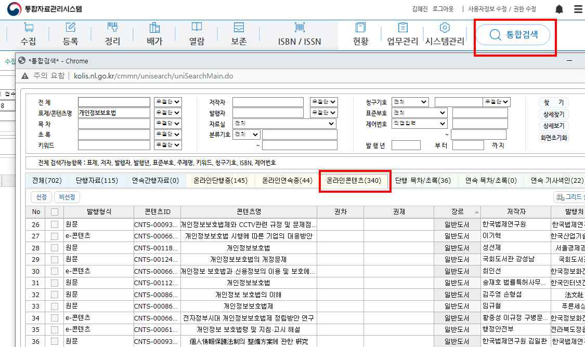

## 쪽 5 (인쇄 5)

- 5 -
        - 검색결과 중에서 온라인자료 선택
        - 원문보기를 통해 납본 자료와 복본인지 확인

  ㅇ 유통 여부 조사
      - 네이버, 구글, 교보문고, 알라딘, YES24, 아마존 등의 판매 사이트
      - 네이버시리즈, 리디북스, 카카오페이지, 레진코믹스, 봄툰, 포스
타입, 북큐브, 유페이퍼, 부크크 등의 플랫폼
  ㅇ 가격 확인 * 참고연재형웹툰웹소설보상금지급기준(안)
      - 납본 자료의 가격이 플랫폼 유통 가격과 일치 여부 확인
      - 조사 당시 유통 미확인 자료의 경우에는 일정 주기로 유통사 재
확인 (무보상이나 비매품은 제외)
  ㅇ 완결 여부
      - 1화 ~ 100화 완결본(PDF)에 대한 1개의 ISBN 발급 완료 - 납본 대상
      - 1화 ~ 100화(JPG)에 대한 각각 ISBN 발급 후 완결된 경우- 납본 대상
* 상이한 파일 포맷형식이지만 동일한 내용의 콘텐츠인 경우는 납본은 하나의 형태에 대해서
만 가능함
      - 1화 ~ 100화의 1부 완결 후 2부 첫 화가 101화로 시작하는 경
우, 미완결 자료로 판단
      - 1화 ~ 100화의 1부 완결 후 2부 첫 화가 다시 1화로 시작하는
경우에는 1부는 완결로 보고 1부는 납본 대상에 해당

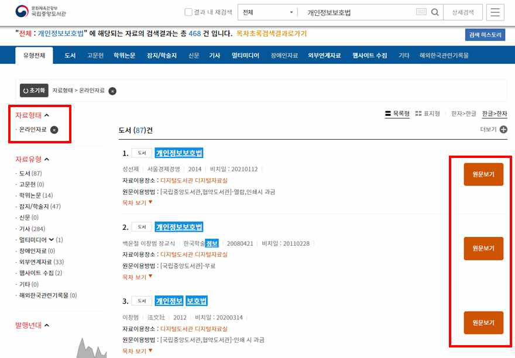

## 쪽 6 (인쇄 6)

- 6 -
  ㅇ 종이책 유무
      - 고가자료의 경우 종이책의 납본 여부 확인
      - 온라인 자료의 정가가 종이책 정가보다 높은 경우, 보상금액은
종이책 정가 기준으로 처리
3. 자료 등록(KOLIS)
 3.1 사전작업
   ㅇ 출판사로부터 받은 메타데이터 및 원문파일 확인
      - 원문파일은 표지 및 판권면 파일을 열어서 제목, 저자 등의 기
본정보를 확인하고 전체 이미지 파일의 이상유무 확인
   ㅇ 메타데이터 확인 후 반입용 엑셀 양식에 맞게 수정 입력
   ㅇ 메타데이터(엑셀파일) 1개당 500건 메타데이터 입력
   ㅇ 원문파일은 콘텐츠(ISBN)별로 폴더 생성하고 폴더 안의 개별 파일
은 일련번호(8자리)로 파일명 변경 * 다크네이머 프로그램 사용
• 네이버등검색포털에서다크네이머검색, 설치
• 파일명일괄변경할이미지파일드래그후다크네이머창으로복사
• 순서대로파일정렬후이름지우기> 번호붙이기(8자리수/ 시작값1) > 변경적용
• 원래파일명이숫자형태라면자리수맞추기로설정하여변경

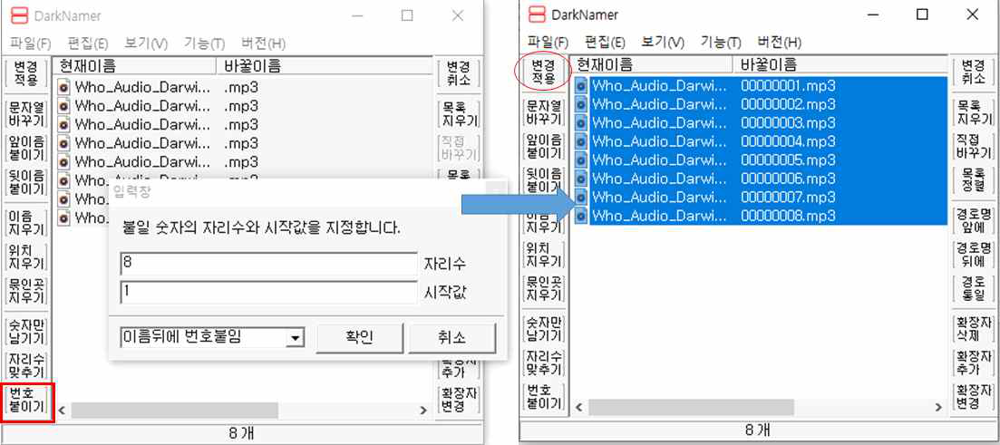

## 쪽 7 (인쇄 7)

- 7 -

3.2 수집 > 납본 > 온라인 > 단행 > 납본접수 > 납본자료접수
   가. 메타데이터 일괄반입
    ㅇ 일괄반입 > 신규접수번호 생성 > 반입샘플에 맞추어 메타데이터 첨부 > 반입
    ㅇ 비고란 기재 = 2026-납본-웹툰대행(1차)(1)
    ㅇ 반입한 결과를 확인하고 그 결과 생성된 콘텐츠ID(CNTS번호)로

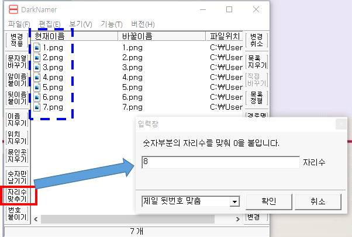

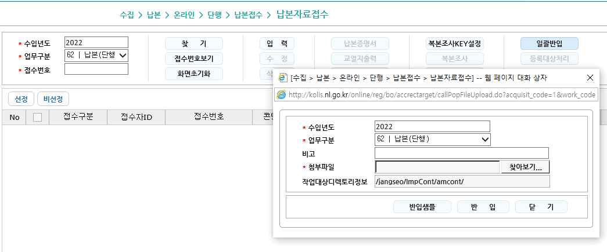

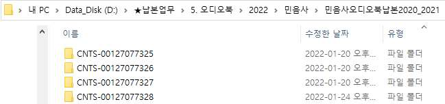

## 쪽 8 (인쇄 8)

- 8 -
원문파일 폴더명 수정
   나. 원문일괄등록(폴더)
    ㅇ 원문일괄등록은 등록 프로그램이 익스플로러에서만 실행되기 때
문에 마이크로소프트 엣지에서 익스플로러 모드로 접근해야 함
    ㅇ 익스플로러 버전에서 KOLIS 로그인해서 ‵원문일괄등록(폴더)′ 클릭
      ① 파일 부분에 원문 폴더 드래그해서 붙여넣기 (여러 개 가능)
* 10GB 처리시30분정도소요됨
      ② 폴더 붙여 넣은 후 ‵전송하기′
      ③ 업로드 된 폴더 확인
      ④ 각각의 폴더 클릭해서 파일이 제대로 등록되었는지 확인
      ⑤ 일괄정보입력 : 기계적으로 면수 체크해서 일괄 입력 됨(정보입력
결과 확인)
      ⑥ 원문등록 : 원문등록 결과 확인 후 저장
    ㅇ 원문유형 열람, 보존 보두 반입 등록이후 창 닫고 자료 선택하여
코리스 수정

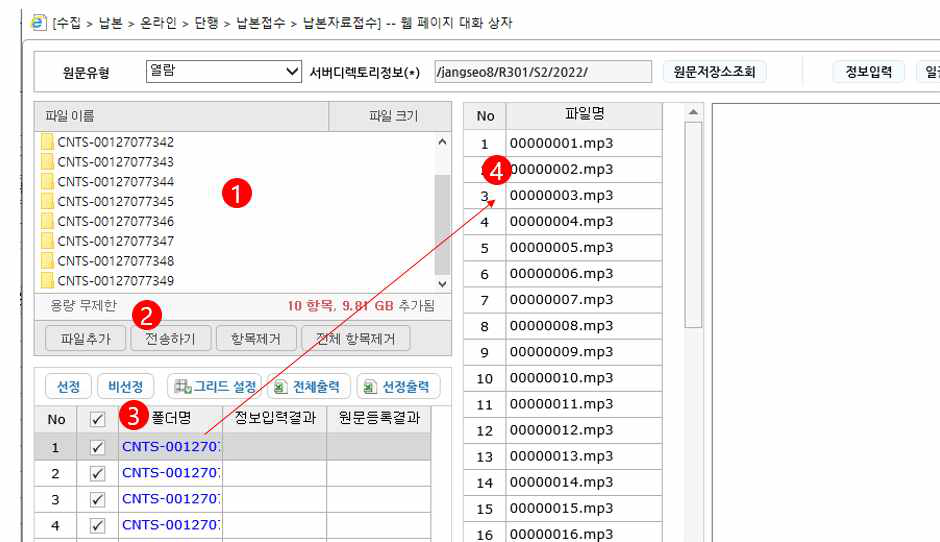

## 쪽 9 (인쇄 9)

- 9 -
    ㅇ 원문등록 > 썸네일 파일 추가 및 전송 > 원문유형 : 썸네일로 변
경 후 확인

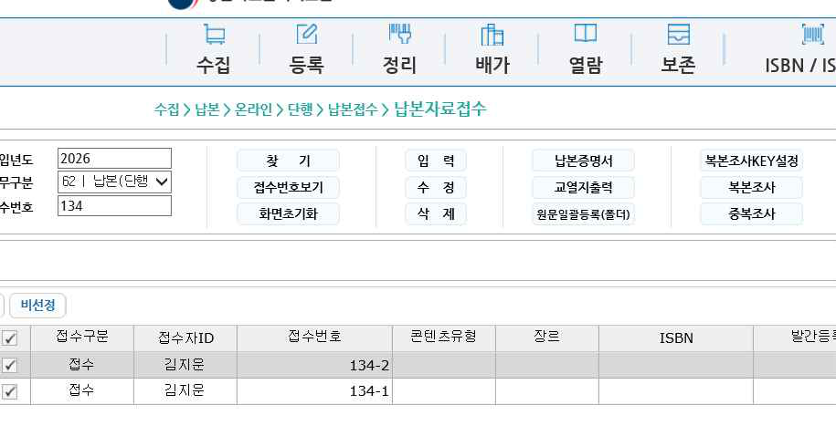

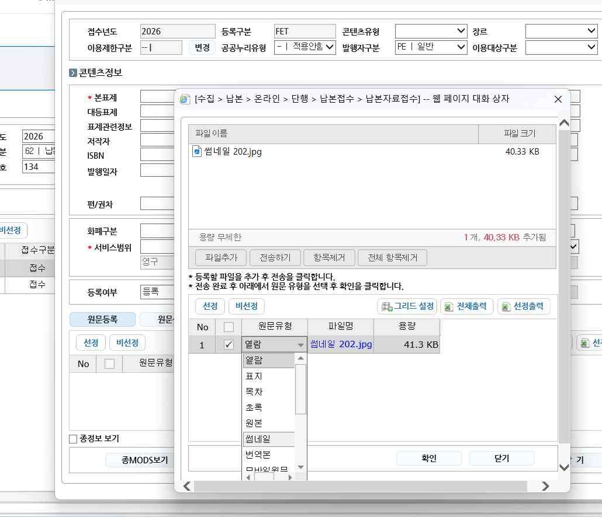

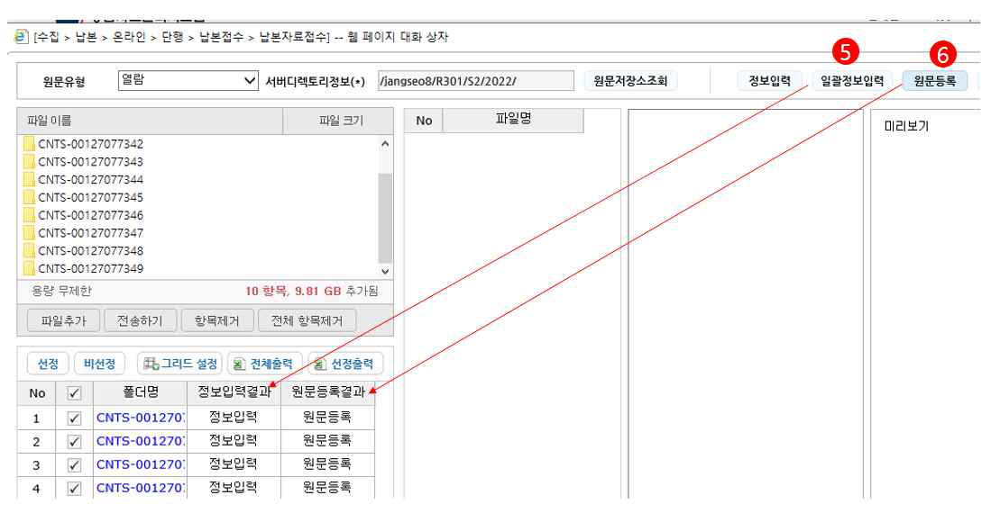

## 쪽 10 (인쇄 10)

- 10 -
    ㅇ 모든 콘텐츠 작업 완료 후 전체 체크선정 후 등록대상처리
3.3 등록 > 온라인 > 등록원부작성 > 가원부번호 받기
   ㅇ 등록대상처리한 접수번호로 찾기
     - 수정 : 콘텐츠유형(T 텍스트), 장르(T17 만화), 이용대상구분, 서비
스범위(국중공개) 등
   ㅇ 가원부받은 자료 선정 후 [원부작성]
     - 이용대상자, 서비스범위가 동일한 자료만 선정하여 [원부작성]
     - 원문서비스구분 : 07 납본뷰어

   ㅇ 가원부번호 목록 담당 주무관에게 전달
4. 보상금 지급
출판사가 서류 제출
1. 납본서/보상청구서
2. 전자계산서(ISBN/UCI 있을 경우)
전자세금계산서(ISBN/UCI 없을 경우)
→
매달 국립중앙도서관에 보상금 청구
→
출판사에게 납본보상금 대량 이체
→
출판사 폐업, 보상금 거절 시
보상금 반납 등 처리
→
매분기 국립중앙도서관에
이체 결과 제출
→
사업완료 시
정산보고서 제출
→
   ㅇ 매월 말에 보상금 청구 처리
   ㅇ 보상금 청구 시 아래 서류를 담당 주무관에게 문서24 전자공문를 통해 제출
      - 도서관자료 납본서·보상청구서(n차)
      - 도서관자료 납본보상금 청구내역(n차)
      - 도서관자료 납본보상금 신청목록(n차)
      - 도서관자료 납본보상금 지급대상처(n차)
      - 납본자료 제출 및 보상금 지급 확인서(n차)

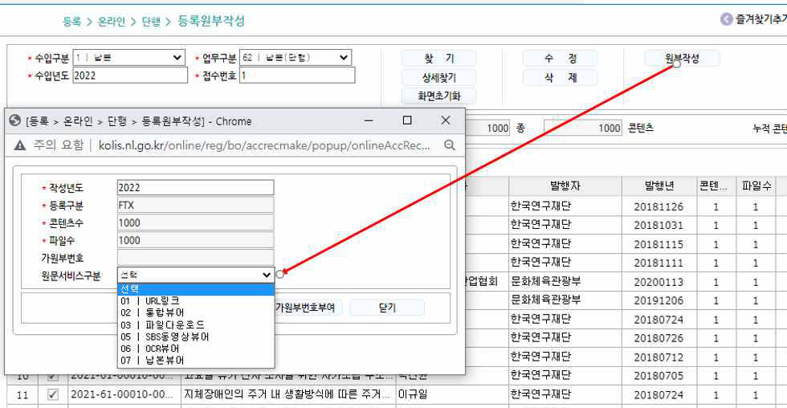

## 쪽 11 (인쇄 11)

- 11 -
   ㅇ 매분기 말에 납본보상금 지급 결과 제출
   ㅇ 결과 제출 시 아래 서류를 담당 주무관에게 문서24 전자공문를 통해 제출
      - 도서관자료 납본보상금 청구목록 및 지급내역(n차) > 분기별 파
일 압축
      - 도서관자료 납본보상금 이체결과(n차) > 분기별 파일 압축

## 쪽 12 (인쇄 12)

- 12 -

□ 법적 근거
   ㅇ 납본 대상 자료가 판매용인 경우는 정당한 보상 실시(도서관법 제
21조제3항)
   ㅇ (보상가) 납본·수집된 자료의 시가(정가)에 이용자의 열람에 제
공되는 자료의 부수를 곱한 금액(도서관법 시행령 제18조제3항)
     * 자료의 시가 × 열람용 자료 수
   ㅇ 보상가가 합리적이지 않을 경우, 도서관자료심의위원회에서 유사한
자료의 통상적 거래 가격을 고려하여 산정(도서관법 시행령 제18조제
4항)
□ 추진 배경
   ㅇ (정가 미정립) 연재형 콘텐츠는 판매형이 아니라 구독형으로 제공
되고 있어, 일반도서의 정가 개념이 미정립된 상황
    → 연재형 웹콘텐츠의 보상금 지급 기준 마련 필요
   ㅇ (적용범위) 연재형 웹툰, 웹소설
유형
유형설명
연재형
완결
일부완결(n부만완결) 웹툰, 웹소설
전체완결웹툰, 웹소설
미완결
연재중단, 2년이상휴재웹툰, 웹소설
연재중웹툰, 웹소설
* 연재형콘텐츠는자료의수정·편집이상시가능함을고려하여완결작우선
수집
□ 보상금 지급 기준(안)
   ㅇ 공통
   - 연재 플랫폼의 회차당 가격을 콘텐츠가로 간주하여 보상금 산정
참고 연재형 웹툰·웹소설 보상금 지급 기준(안)
 연재형 웹툰·웹소설 보상금 지급 기준(안)

## 쪽 13 (인쇄 13)

- 13 -
＊소장(다운로드)과대여(스트리밍) 가격이다를경우소장가격을기준으로보상금
지급
< 연재형콘텐츠보상금산출식>
회차수X 회차당가격(원) = 지급보상금(원)
   - 플랫폼별 콘텐츠 가격 차이가 있을 경우, 최초 연재처 가격으로 보상금 지급
   - 코인, 캐시 등 플랫폼의 전용 가상화폐 사용 시 원화 단위로 환산 후 지급
   - ‘기다리면 무료’의 자료는 즉시 이용가능 가격 기준으로 보상금 지급
   - 플랫폼이 소멸되어 콘텐츠 가격 확인 불가한 경우, 평균가
1) 일괄 지급
구분
1회최소소장가
1회최대소장가
평균가
웹툰
300
800
550
웹소설
100
150
150
[단위: 원]
   - 내용과 기본 서지사항이 동일하고 채색, 열람 방식만 다른 경우 최초
발간된 콘텐츠만 수집하고 보상금 지급
   ㅇ 웹소설
   - 수집한 포맷이 PDF인 경우, OCR 처리된 파일을 우선 수집하고 보상금 지급
1) 국립중앙도서관. 2022. 「온라인 자료 수집 보상체계 수립방안 연구」, p. 97, 118

## 쪽 14 (인쇄 14)

- 14 -
5.  웹툰 데이터 구축
   ㅇ 처리 절차
      - 담당 주무관에게 원부단위 자료 목록 인계 받은 후 원부정보 수정
      - 데이터 구축 끝난 후 점검 과정 거침
 5.1 등록 > 온라인 > 단행 > 등록원부대장관리
납본
구분
웹툰구분값
수입구분
1 | 납본
등록구분
FTX | (온)텍스트
작성년도
2026
작업자
등록자= 김지운
원부자료구분
수집팀에서메타데이터파일등자료접수및등록시기재
예시) 2026-납본-웹툰대행(1차)(1)
작업상태
등록, 정리, 인수*, 서비스(배가완료), 보존(비공개배가완료)
*인수: 정리완료& 배가처리(서비스or 보존) 이전
일자
등록일자, 인수일자(정리팀인수일), 인계일자(정리완료후
인수인계처리일)
원부정보수정
수집팀에서인계받은원부에대해인수작업자,인수일자입력
원부정보일괄수정
여러개의원부에대해원부정보일괄입력
 5.2 정리 > 디지털콘텐츠 > 온라인 > 단행 > 복본조사 > 일괄복본조사
   ㅇ 복본조사KEY설정(맨 처음 사용할 때만 설정)

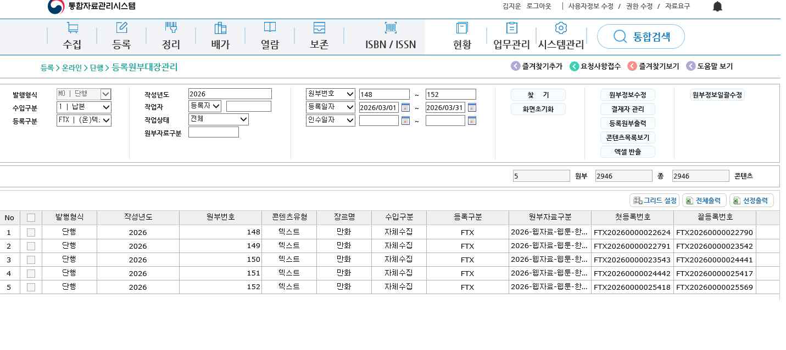

## 쪽 15 (인쇄 15)

- 15 -
   ㅇ 검색된 원부에 대한 콘텐츠 전체 선택 후 복본조사 실행
구분
웹툰구분값
수입년도
2026
등록구분
FTX | (온)텍스트
상세보기
복본조사결과상세보기
완료
복본조사마친후‘완료’ 필수
정리대상원부보기
정리대상자료검색
 5.3 정리 > 디지털콘텐츠 > 온라인 > 단행 > 디지털콘텐츠관리
   ㅇ 개별 콘텐츠 MODS 정리를 통해 데이터 입력

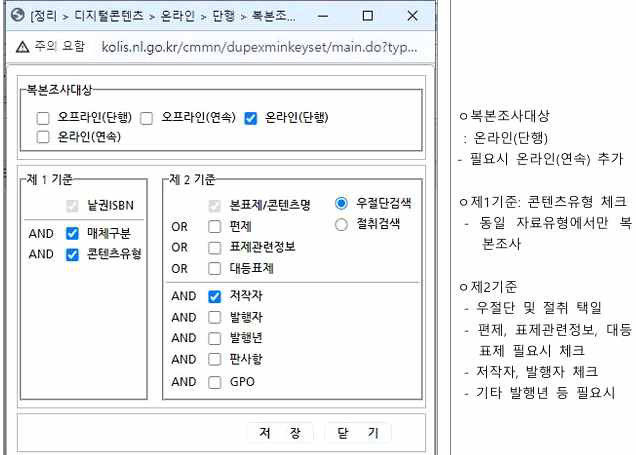

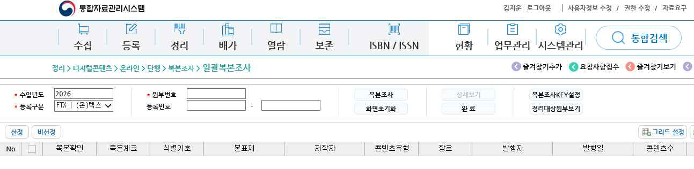

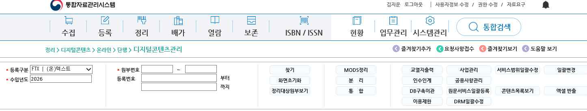

## 쪽 16 (인쇄 16)

- 16 -
구분
웹툰구분값
분리/통합
자료를다른콘텐츠로분리하거나서로다른종통합시사용
교열지출력
콘텐츠교열지출력
이용제한
성인자료등이나기타사유로이용제한시개별또는일괄
처리
공용사항관리
여러콘텐츠의MODS 데이터를일괄입력하고자할때
원문서비스일괄등록
/서비스범위일괄수정
원문서비스(뷰어)나서비스범위일괄수정
일괄변경
자료유형, 발행구분, 공공누리유형일괄변경

## 쪽 17 (인쇄 17)

- 17 -
 ★ 웹툰 정리 세부 지침(MODS)
   ㅇ 정리 준거 규칙
순번
준거규칙
1
한국목록규칙제4판및보유편(전자책전자저널기술규칙)
한국목록규칙제5판
2
MODS 3.7
3
한국십진분류법6판
4
한국문헌자동화목록-통합서지용
5
RDA
   ㅇ 기술 정보원은 일반적으로 아래와 같은 순위로 중요도를 매겨 채
택하되 필드 항목에 따라 다를 수 있으므로 각 항목의 세부규칙
내용을 따름
      ① 원시자료: 초기 제작된 원래 형태의 온라인 자료, 추출한 메타항목
      ② 기초메타데이터: 자료 수집 과정에서 확인된 기초메타데이터
      ③ 수집자료: 국립중앙도서관에서 수집하여 보관하고 있는 파일(열
람용, 보존용) 및 정보
      ④ 검색자료: 외부 정보원(ex.포털)을 통해 검색한 정보
   ㅇ 필드명 정의 및 채택 정보원
필드명
세부항목
정의
첫 번째
채택정보원
표제정보
표제
표제관련정보
권차
권차표제
불용어
웹툰의 제작자가 붙인 웹툰의 제목
수집 자료
저자정보
저자명
역할/역할어
디스플레이 형식
다른이름
기타
웹툰의 지적 예술적 내용의 창조, 구현에 책임이 있거나 기
여한 개인, 단체(원시 자료의 원작자)
수집 자료
콘텐츠유형
구축대상 웹툰의 유형
수집 자료
장르
콘텐츠의 특정 스타일, 형식, 내용 등의 범주
수집 자료
출처정보
발행지, 발행처,
발행일, 판사항,
발행연속성, 간행빈도
-발행지: 자료의출처와관련된장소정보
-발행처: 자료의발행, 배포등에관련된단체, 기관의이름
-발행일: 발행, 생성 등에 관련된 날짜
-판사항: 저작의 판과 관련되는 정보를 기술
-발행연속성: 자료의 발행주기(단행자료, 연속간행자료)
-간행빈도(주간, 월간, 연간 등)
수집 자료
언어
언어
웹툰의 내용을 표현하기 위한 언어
수집 자료

## 쪽 18 (인쇄 18)

- 18 -
 * 채택정보원은 첫 번째 채택정보원정보가 없을 경우 ‘기술의 정보원’(p.13)의 경우에 따른다.
   ㅇ 메타데이터 항목 및 MODS 요소
메타데이터 항목
MODS 요소
반복여부
필수여부
표제정보
<titleInfo>
○
필수
  표제
<titleInfo><title>
○
필수
  표제관련정보
<titleInfo><subTitle>
○
해당 시 필수
  권차
<titleInfo><partNumber>
○
해당 시 필수
  권차표제
<titleInfo><partName>
○
해당 시 필수
  불용어
<titleInfo><nonSort>
해당 시 필수
저자정보
<name>
○
필수
  저자명
<name><namePart>
○
필수
  역할/역할어
<name><role><roleTerm>
해당 시 필수
  디스플레이 형식
<name><displayForm>
선택
  다른이름
<name><alternativeName><namePart>
○
해당 시 필수
  기타
<name><etal>
해당 시 필수
콘텐츠유형
<typeOfResource>
필수
장르
<genre>
필수
출처정보
<originInfo>
○
필수
  발행지/발행지명
<originInfo><place><placeTerm>
○
해당 시 필수
  발행처
<originInfo><publisher>
○
필수
  발행일
<originInfo><dateIssued>
○
해당 시 필수
  판사항
<originInfo><edition>
해당 시 필수
필드명
세부항목
정의
첫 번째
채택정보원
형태기술정보
자료형태, 디지털품질,
디지털자료유형,수량
(크기), 원자료형태
웹툰의 형태와 수량 등 자료 관리와 보존에 필요한 사항
수집 자료
이용대상자
대상 자료의 이용자 그룹
수집 자료
주제명
일반, 지리, 시대,
표제, 이름, 장르
ㆍ웹툰이 포괄하고 있는 주제를 표현하는 단어나 구
ㆍ국립중앙도서관 주제명표목표
수집 자료
분류기호
웹툰의 분류기호(KDC6)
수집 자료
연관정보
표제정보
레코드정보
연관된 다른 콘텐츠에 관한 정보
표제정보 : 자료의 시리즈 정보
레코드정보 : 동일 내용 오프라인 자료의 제어번호
수집 자료
식별기호
웹툰을 식별하는데 필요한 각종 표준번호나 코드
수집 자료
소장정보
원문주소, 소장위치
웹툰에 대한 소장 또는 접근정보
원문주소 : 웹툰의 전자적 접근 주소
기초메타데이
터
접근제한정보
접근제한유형
웹툰의 사용이나 접근에 대한 제한, 제약에 관한 정보
기초메타데이
터
로컬정보
지역구분
한국대학부호
한국정부기관부호
한국공공기관부호
발행처의 지역 정보
KORMARC 한국대학부호, 한국정부기관부호, 한국공공기관
부호
수집 자료

## 쪽 19 (인쇄 19)

- 19 -
   ㅇ 세부규칙
      - 공통 적용사항
      ① 으뜸 정보원 이외에서 얻은 정보는 각괄호([])로 묶어 기술
      ② 기술사항에 입력될 정보에 각괄호([])가 포함된 경우 각괄호를
원괄호(())로 변경하여 기술
1. 표제정보<titleInfo>
【 반복, 필수 】
§
전자책 정리 지침에 따른다.
1) 1.1 본표제<titleInfo><title>
【 반복, 필수 】
①표제 앞에 기재된 문구, 관제는 자료에 쓰인 그대로 입력하되 원괄호로 묶어 표제와
구별한다.
  발행연속성
<originInfo><issuance>
필수
언어
<language>
○
필수
  언어
<language><languageTerm>
○
필수
형태기술정보
<physicalDescription>
필수
  자료형태
<physicalDescription><form>
필수
  디지털 품질
<physicalDescription><reformattingQuality>
필수
  디지털 자료유형
<physicalDescription><internetMediaType>
필수
  수량(크기)
<physicalDescription><extent>
필수
  원자료형태
<physicalDescription><digitalOrigin>
필수
내용목차정보
<tableOfContents>
○
해당 시 필수
이용대상자
<targetAudience>
필수
주기사항
<note>
○
해당 시 필수
주제명
<subject>
○
해당 시 필수
  일반주제명
<subject><topic>
○
해당 시 필수
  지리주제명
<subject><geographic>
○
해당 시 필수
  시대주제명
<subject><temporal>
○
해당 시 필수
  표제주제명
<subject><titleInfo>
○
해당 시 필수
  이름주제명
<subject><name>
○
해당 시 필수
  장르주제명
<subject><genre>
○
해당 시 필수
분류기호
<classification>
○
필수
연관정보
<relatedItem>
○
해당 시 필수
  표제정보/표제
<relatedItem><titleInfo><title>
○
해당 시 필수
  표제정보/권차
<relatedItem><titleInfo><partNumber>
○
해당 시 필수
  표제정보/권차표제
<relatedItem><titleInfo><partName>
○
해당 시 필수
  레코드정보/제어번호
<relatedItem><recordInfo><recordIdentifier>
○
해당 시 필수
식별기호
<identifier>
○
해당 시 필수
소장정보
<location>
○
필수
  원문주소
<location><url>
○
해당 시 필수
  소장위치
<location><physicalLocation>
○
필수
접근제한정보
<accessCondition>
필수
  접근제한유형
<accessCondition><licenseType>
필수
로컬정보
<extension>
○
해당 시 필수
  지역구분
<extension><regionOfPublishing>
해당 시 필수
  한국대학부호
<extension><KoreaUniversity>
해당 시 필수
  한국정부기관부호
<extension><KoreaGovernment>
해당 시 필수
  한국공공기관부호
<extension><KoreaPublicInstitution>
해당 시 필수

## 쪽 20 (인쇄 20)

- 20 -
②원괄호( )에 해당하는 내용에서 ★☆ 등의 모양기호는 기입하지 않으며 괄호 안에
괄호가 중복되는 경우는 그대로 기입한다.
①이외 기술에 관한 사항은 전자책 정리 지침에 따른다.
<웹툰 DB>
<메타데이터
입력화면>
[그림] 표제<titleInfo><title> 입력화면
③대표표제 아래 개별표제를 지니고 있는 각각의 작품들의 경우, 본문에 대표표제가
기재되어있다면 이를 본표제로 사용하고, 대표표제가 없고 개별표제만 기재되어있을
경우 개별표제를 본표제로 기입 후, 연관정보-총서관계 표제에 대표표제를 기입한다.
본표제
연관정보
-총서관계
[그림] 단편집 사례
2) 1.2 표제관련정보<titleInfo><subTitle>
【 반복, 해당시필수 】
①‘시즌 2’ , ‘season 3’, ‘외전’ 등 웹툰의 시리즈 번호, 시즌 번호, 외전 회차를 나타내는
문구는 원문에 있는 그대로 표제관련정보에 입력한다.
②제목 뒤 숫자 2, 3, 4 / 로마자 II, III 등이 기재되어 있는 경우 본표제에 포함한다.
③이외 기술에 관한 사항은 전자책 정리 지침에 따른다.
3) 1.3 권차<titleInfo><partNumber>
【 반복, 해당시필수 】
①웹툰 원문에 2부, 3부 등 부분을 나타내는 차수가 적힌 경우 권차에 입력한다.

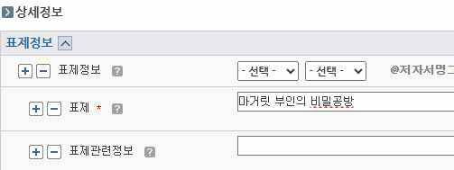

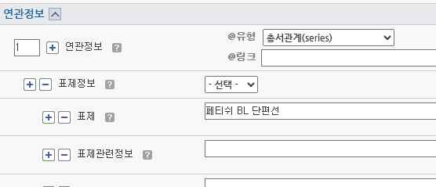

## 쪽 21 (인쇄 21)

- 21 -
<웹툰
DB>
<메타데이터
입력화면>
[그림] 권차<titleInfo><partName> 입력화면

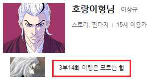

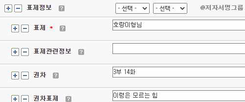

## 쪽 22 (인쇄 22)

- 22 -
②웹툰의 1부와 2부의 회차 정보가 이어지더라도 원문 그대로 입력한다.
<웹툰 원문>
->시즌 2의 5번째 자료임.
시즌 1의 회차와 이어지는 회차
<메타데이터
입력화면>
[그림] 권차<titleInfo><partName> 입력화면
③회차에 0화, 0회 등 0차를 표현한 권차가 있다면 그대로 기술한다.
<웹툰 원문>
<메타데이터
입력화면>
[그림] 권차<titleInfo><partName> 입력화면
④웹툰의 처음과 끝 등에 회차 없이 프롤로그, 에필로그 등의 문구가 있는 경우 권차를 입
력하지 않고 권차표제에 해당 문구만 입력한다.
4) 1.4 권차표제<titleInfo><partName>
【 반복, 해당시필수 】
①권차표제 뒤에 한 제목의 여러 회차를 나타내는 숫자, 로마자 등 회차 정보가 쓰여있다
면 권차표제에 원문, 웹툰DB에 적힌 대로 입력한다.

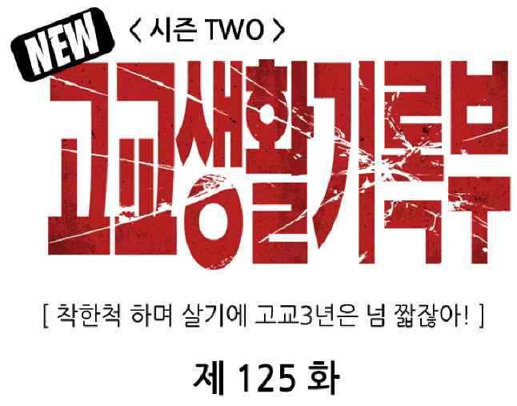

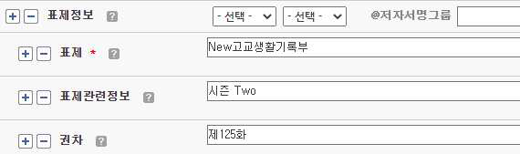

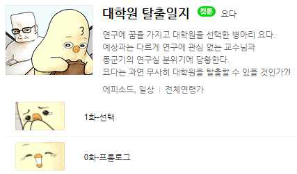

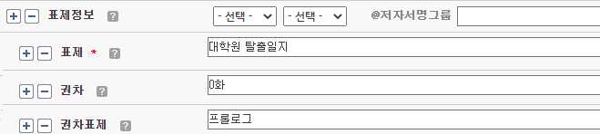

## 쪽 23 (인쇄 23)

- 23 -
<웹툰 DB>
<메타데이터
입력화면>
[그림] 권차표제<titleInfo><partName>입력화면
②이외 기술에 관한 사항은 전자책 정리 지침에 따른다.
5) 1.5 불용어<titleInfo><nonSort>
【 반복불가, 해당시필수 】
§
전자책 정리 지침에 따른다.
2. 저자정보<name>
【 반복, 필수 】
①웹툰의 ‘글, 작가, 그림, 작화, 각색, 원작’ 등 주된 책임이 있는 개인이나 단체에 관한
이름을 입력하며, ‘어시스트, 콘티, 채색, 배경, 편집’ 등 작품의 보조 역할을 담당한
저자의 정보는 입력하지 않는다. 단, 글, 각색 등에 해당하는 책임표시가 없고 ‘콘티’만
있는 경우, ‘콘티’를 주된 저자로 보고 입력한다.

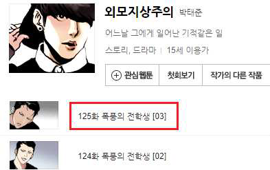

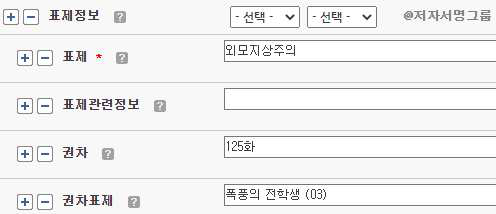

## 쪽 24 (인쇄 24)

- 24 -
<원문>
<메타데이터 입력화면>
[그림] 저자정보<name> 입력화면
①저작의 역할을 달리하는 여러 명의 저자를 입력하는 경우 정보원에 쓰인 순서, 글자 크기
에 따라 저자정보 항목을 추가하여 기재한다.
①이외 기술에 관한 사항은 전자책 정리 지침에 따른다.
6) 2.1 저자명<name><namePart>
【 반복, 필수 】
§
전자책 정리 지침에 따른다.
<웹툰 DB>
<메타데이터
입력화면>
[그림] 저자명<name><namePart>입력화면
7) 2.2 디스플레이 형식<name><displayForm>
【 반복불가, 선택 】
§
사용하지 않는 항목
8) 2.3 역할어<name><role><roleTerm>
【 반복, 해당시필수 】
§
전자책 정리 지침에 따른다.

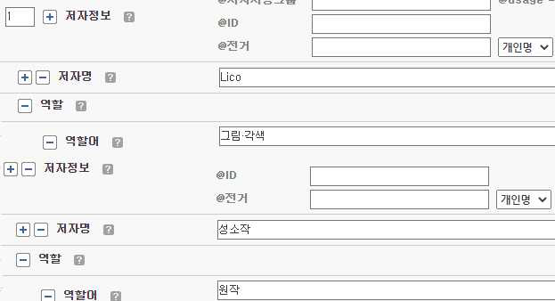

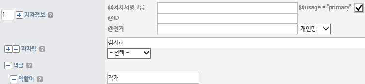

## 쪽 25 (인쇄 25)

- 25 -
<원문>
<메타데이터 입력화면>
[그림] 역할어<name><role><roleTerm>입력화면
9) 2.4 다른이름<name><alternativeName>
【 반복, 해당시필수 】
①작가의 본명, 필명 등이 추가로 기재되어 있는 경우 다른이름 유형을 해당 항목에 맞게
선택하여 입력한다(유형-전자책 지침 참고).
3. 콘텐츠유형<typeOfResource>
【 반복불가, 필수 】
①웹툰의 콘텐츠유형은 “텍스트”로 선택한다.
[그림] 콘텐츠유형<typeOfResource> 입력화면
4. 장르<genre>
【 반복불가, 필수 】
①웹툰의 장르는 “만화”로 선택한다.
5. 출처정보<originInfo>
【 반복, 필수 】

①웹툰의출처정보는최초발간된웹툰과그플랫폼을기준으로한다.
②이외기술에관한사항은전자책정리지침에따른다.

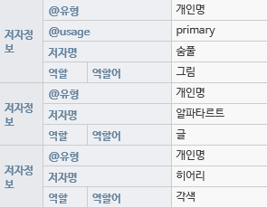

## 쪽 26 (인쇄 26)

- 26 -
<웹툰 DB>
<메타데이터
입력화면>
[그림] 출처정보<originInfo> 입력화면
10) 5.1 발행지명<originInfo><place><placeTerm>
【 반복, 해당시필수 】
①웹툰이 발행된 발행지명을 텍스트와 코드 값으로 구분하여 입력한다.
②이외 기술에 관한 사항은 전자책 정리 지침에 따른다.
11) 5.2 발행처<originInfo><publisher>
【 반복, 필수 】
①웹툰의 발행처는 최초 발간된 웹툰의 플랫폼 또는 출판사를 기준으로 입력한다.
①이외 기술에 관한 사항은 전자책 정리 지침에 따른다.
12) 5.3 발행일<originInfo><dateIssued>
【 반복, 해당시필수 】
①웹툰이 발행된 발행연월일을 아라비아 숫자로 YYYYMMDD형식으로 입력한다.
<웹툰 DB>
<메타데이터
입력화면>
[그림] 발행일<originInfo><dateIssued>입력화면
①이외 기술에 관한 사항은 전자책 정리 지침에 따른다.
13) 5.4 판사항<originInfo><edition>
【 반복불가, 해당시필수 】

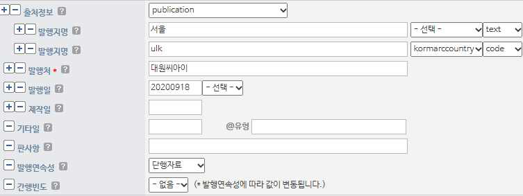

## 쪽 27 (인쇄 27)

- 27 -
①웹툰의 판사항은 입력하지 않는다. 다만, 필요한 경우에는 ‘전자책 정리 지침’을 참고하여
기술한다.
14) 5.5 발행연속성<originInfo><issuance>
【 반복불가, 필수 】
①웹툰은 ‘단행자료’를 기본값으로 입력한다. (간행빈도 없음)
[그림] 발행연속성<originInfo><issuance>입력화면
6. 언어<language><languageTerm>
【 반복, 필수 】
§
전자책 정리 지침에 따른다.
7. 형태기술정보<physicalDescription>
【 반복, 필수 】
①웹툰의 물리적인 형태에 관한 정보인 자료형태, 디지털품질, 디지털자료유형, 수량(크기),
원자료형태를 입력한다.
[그림] 형태기술정보<physicalDescription> 입력화면
15) 7.1 자료형태<physicalDescription><form>
【 반복불가, 필수 】
※ 자료형태는 파일 확장자에 따라 구분하며 이미지 파일은 ‘전자자료(Image)’를 선택한다.

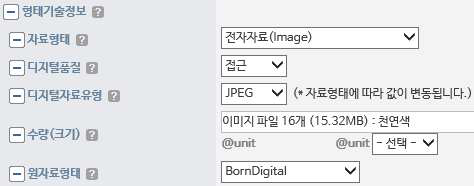

## 쪽 28 (인쇄 28)

- 28 -
[그림] 자료형태<physicalDescription><form> 입력화면
16) 7.2 디지털 품질<physicalDescription><reformattingQuality>
【 반복불가, 필수 】
§
전자책 정리 지침에 따른다.
17) 7.3 디지털 자료유형<physicalDescription><internetMediaType>
【 반복불가, 필수 】
①웹툰의 전자형식 유형의 식별을 위한 내용으로 유형 또는 포맷을 입력한다.
자료형태
자료유형
전자자료(Image)
GIF, JPEG, PNG, SVG, TIFF, ICO, JPG, BMP
(현재 JPEG 값 중복. 첫 번째 것으로 입력)
18) 7.4 수량(크기)<physicalDescription><extent>
【 반복불가, 필수 】
①이미지 파일의 수량, 파일용량, 색상정보를 다음과 같은 형식으로 기술한다.
예) 이미지✓파일✓16개✓(12.5MB)✓:✓천연색
②이미지의 용량은 '아라비아 숫자✓단위'로 기술하되 단위는 ‘bytes’뿐만 아니라 ‘KB’, ‘M
B’, ‘GB’를 적절히 사용하여 기술한다.
①수집 자료 이미지에 대한 색상정보를 ‘천연색’, ‘흑백’ 중 하나로 기술하되, 무채색을
제외하고 색상이 한 가지 이상 사용된 유채색인 경우는 ‘천연색’으로 기술하고, 색상이
없이 무채색으로 이루어진 경우는 ‘흑백’으로 기술한다.
※ 무채색 : 흰색, 회색, 검정색과 같이 색조가 없고 명도의 차이만 있는 색
   유채색 : 색상을 갖는 모든 색
③하나의 제어번호에 이미지 파일이 여러 개인 자료는 파일의 총 크기를 입력한다(반올
림하여 소수점 두 자리까지만 입력).

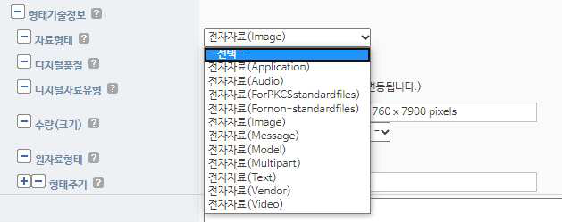

## 쪽 29 (인쇄 29)

- 29 -
 [그림] 수량(크기)<physicalDescription><extent>입력화면
19) 7.5 원자료형태<physicalDescription><digitalOrigin>
【 반복불가, 필수 】
§
전자책 정리 지침에 따른다.
8. 이용대상자<targetAudience>
【 반복불가, 필수 】
①이용대상자의 유형은 ‘고등학생, 성인용, 아동용, 일반이용자, 중학생, 초등학생, 취학전
아동, 특수계층, 미상’이며, 기본은 ‘일반이용자’로 한다.
[그림] 이용대상자<targetAudience> 입력화면
②이용대상자 선택 항목에 없는 구체적인 연령이나 기타 사항을 자료에서 찾아 입력할 시, 주
기사항-이용대상자 주기를 사용한다.
9. 주기사항<note>
【 반복, 해당시필수 】
①입수처 주기 (유형: 입수처(acquisition))
예) 한국만화영상진흥원을 통해 수집한 자료임
②이용대상자 주기 (유형: 이용대상자(target audience))
자료의 대상 연령, 특성 등이 자료에 기술된 경우 이용대상자 주기 항목에 입력한다.
예) 성인용 자료 : “19세 미만 구독불가”
③이외 주기사항이 있으면 전자책 정리 지침을 참고한다.
10. 주제명<subject>
【 반복, 해당시필수 】
§
전자책 정리 지침에 따른다.
20) 10.1 일반주제명<subject><topic>
【 반복, 해당시필수 】
§
전자책 정리 지침에 따른다.

## 쪽 30 (인쇄 30)

- 30 -
21) 10.2 지리주제명<subject><geographic>
【 반복, 해당시필수 】
§
전자책 정리 지침에 따른다.
22) 10.3 시대주제명<subject><temporal>
【 반복, 해당시필수 】
§
전자책 정리 지침에 따른다.
23) 10.4 표제주제명<subject><titleInfo>
【 반복, 해당시필수 】
§
전자책 정리 지침에 따른다.
24) 10.5 이름주제명<subject><name>
【 반복, 해당시필수 】
§
전자책 정리 지침에 따른다.
25) 10.6 장르주제명<subject><genre>
【 반복, 해당시필수 】
①웹툰의 장르를 주제명으로 표현하고자 할 때 사용한다. (주제명 ‘웹툰’ 입력)
[그림] 장르주제명<subject><genre> 입력화면
11. 분류기호<classification>
【 반복, 필수 】
§
전자책 정리 지침에 따른다.
12. 연관정보<relatedItem>
【 반복, 해당시필수 】
26) 12.1 기타모형관계(otherFormat) 유형
【 반복, 해당시필수 】
①온라인 자료와 동일한 내용의 타 매체자료(단행본, 비도서자료 등 오프라인 자료)가 국립
중앙도서관 장서에 있는 경우, KOLIS 또는 국립중앙도서관 홈페이지에서 검색 가능하도
록 타 매체 자료 제어번호를 입력한다.

## 쪽 31 (인쇄 31)

- 31 -

<홈페이지
MARC보기
화면>
<메타데이터
입력화면>
[그림] 연관정보 레코드제어번호<relatedItem><recordInfo><recordIdentifier>입력화면
13. 식별기호<identifier>
【 반복, 해당시필수 】
§
전자책 정리 지침에 따른다.
14. 소장정보<location>
【 반복, 필수 】
§
전자책 정리 지침에 따른다.
27) 14.1 원문주소<location><url>
【 반복, 필수 】
① 연재형 웹툰의 경우, 연재처 독점 자료가 아닌 이상 동일 작품이라도 연재처, 가격 등의
정보가 상이하기 때문에 확인을 위해 웹툰을 수집한 연재처 URL을 기재한다.
②연재처 URL 기재는 연재처 메인 URL, 작품 상세 URL 2가지 모두를 기재한다.
③데이터 구축 시점 기준 연재처 소멸로 정확한 URL 확인이 불가할 경우에는 기재하지 않는다.

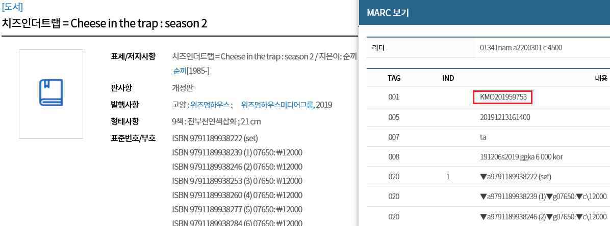

## 쪽 32 (인쇄 32)

- 32 -
<연재처
메인화면>
https://series.naver.com/comic/home.series
<작품
상세화면>
https://series.naver.com/comic/detail.series?productNo=14330942
<메타데이터
입력화면>
[그림] 소장정보<mods:location><mods:url>
28) 14.2 소장위치<location><physicalLocation>
【 반복, 필수 】
§
전자책 정리 지침에 따른다.
15. 접근제한정보<accessCondition>
【 반복불가, 필수 】

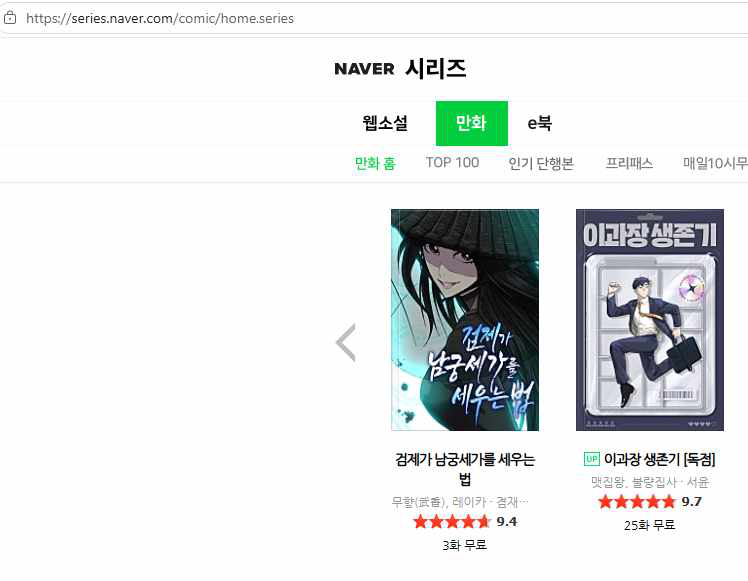

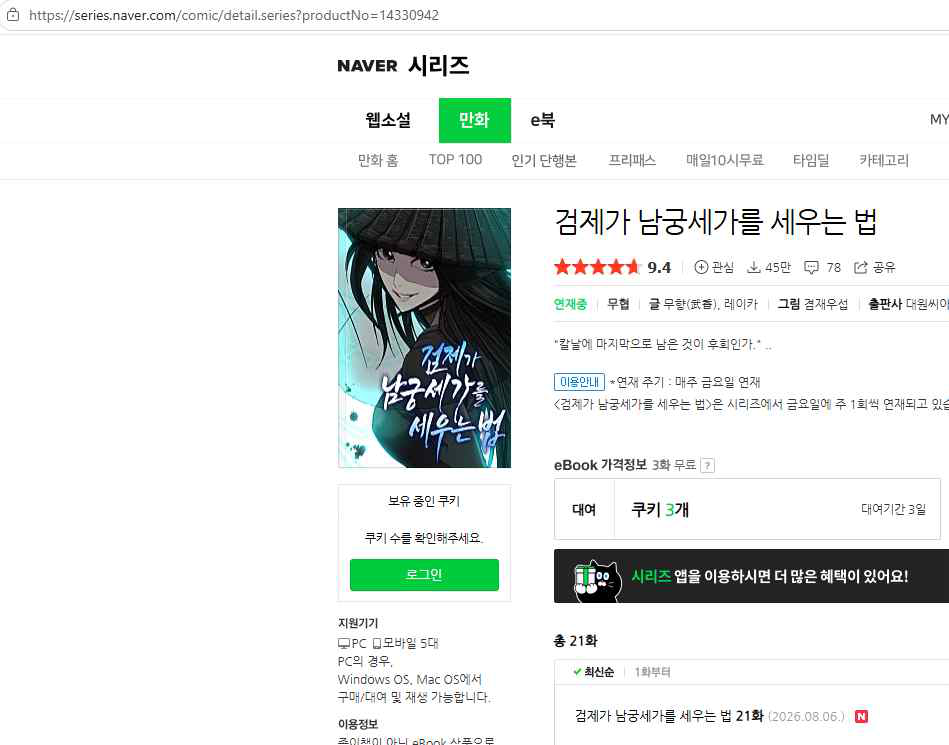

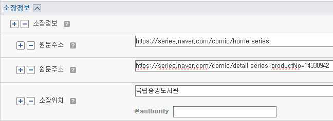

## 쪽 33 (인쇄 33)

- 33 -
29) 15.1 접근제한유형<accessCondition><licenseType>
【 반복불가, 필수 】
§
전자책 정리 지침에 따른다.
16. 로컬정보<extension>
【 반복, 해당시필수 】
§
전자책 정리 지침에 따른다.
30) 16.1 지역구분<extension><regionOfPublishing>
【 반복불가, 해당시필수 】
§
전자책 정리 지침에 따른다.
16.2 한국정부기관 부호<extension><KoreaGovernment>
【 반복불가, 해당시필수 】
§
전자책 정리 지침에 따른다.
16.3 한국대학 부호<extension><KoreaUniversity>
【 반복불가, 해당시필수 】
§
전자책 정리 지침에 따른다.
16.2 한국정부기관 부호<extension><KoreaGovernment>
【 반복불가, 해당시필수 】
§
전자책 정리 지침에 따른다.
